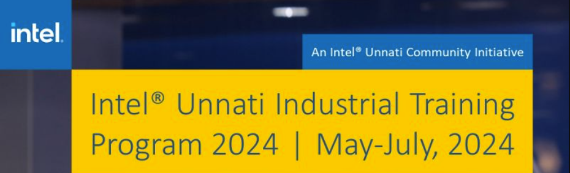

Watch our demo video showcasing the functionality of the Power Manager Telemetry project:

https://github.com/user-attachments/assets/4a2331ba-a67a-4f87-a79c-65c6744d8e65

# Power Manager Telemetry
## Team: Spotlight
#### Team Members :
1. [Midhun Mathew](https://github.com/memidhun)
2. [Ashly Biju](https://github.com/ashlybiju5207)
3. [Sharan Susan Aby](https://github.com/sharansuzn)
4. [Roshan R John](https://github.com/roshanrjohn369)
5. [Blesson Biji](https://github.com/Blesson56B)

#### Project Mentor :
 [Dr. Pradeep C](mailto:pradeep.c@saintgits.org)
 #### Semester : 6
 #### College :
 [Saintgits College of Engineering (Autonomous)](https://saintgits.org/saintgits-college-of-engineering/)
## Problem Statement
In the era of 5G and edge computing, the deployment of devices across various locations has surged, leading to increased power consumption. The government is encouraging enterprises and industries to reduce power usage to achieve net-zero power consumption. Additionally, rising electricity costs make it crucial to understand the total power drawn by systems.

## Unique Idea Brief (Solution)
Our project aims to create a comprehensive telemetry system to monitor and manage power consumption across CPU, memory, NIC, and TDP. By utilizing open-source tools and creating a solution to run and utilize a system while gathering telemetry data, we can measure and analyze system power utilization based on system utilization percentage.

## Features Offered
- Collection of telemetry data from CPU, memory, NIC, and TDP.
- Measurement and recording of system power utilization for different components.
- Running traffic to achieve 100% system utilization using containers.
- Detailed reporting on power consumption issues, technical approaches, and results.

## Process Flow
1. * [x] **Research and Identification**: 
   - Identified and documented open-source tools for power measurement.
   - Documented available knobs in a system to measure power.

2. * [x] **Data Collection**:
   - Collected power telemetry data from CPU, memory, NIC, and TDP.
   
3. * [x] **Utilization Measurement**:
   - Measured and recorded system power utilization for CPU, NIC, and TDP based on system utilization percentage.
   
4. * [x] **Traffic Simulation**:
   - Ran traffic to consume 100% system utilization using containers.
   
5. * [x] **Solution Implementation**:
   - Created a solution to run and utilize a system while collecting telemetry data.
   
6. * [x] **Reporting**:
   - Compiled a detailed report on the power problem, technical approach, and results.

## Plots

- CPU Utilization vs. Power Consumption
- Memory Usage vs. Power Consumption
- NIC Activity vs. Power Consumption
- TDP Levels over Time
- Table

## Technologies Used
- **Programming Languages**: Python, Bash , Powershell Scripts.
- **Tools**: OpenHardware Monitor, HWinfo, powerstat, CPU-Z, Windows Performance Recorder, Performance Analyzer, Power View
- **Platforms**: Linux, Windows
- **Containers**: Kubernetes, Docker

## Team Members and Contributions
- **Midhun Mathew**: Project Leader, Data Collection, Power Measurement Tools Research
- **Ashly Biju**: Traffic Simulation, UI Creation.
- **Sharan Susan Roy**: Solution Implementation, Reporting
- **Roshan R John**: Data Analysis, Plot Generation
- **Blesson Biji**: Data Analysis,  Utilization Measurement.

## Conclusion
Our Power Manager Telemetry project provides a robust solution for monitoring and managing power consumption across critical system components. By leveraging open-source tools and implementing efficient data collection and analysis techniques, we aim to aid enterprises in reducing power usage and achieving net-zero power consumption. Our detailed reporting offers valuable insights into power problems and technical approaches, paving the way for future advancements in sustainable computing.

*Please refer to the project's individual files and directories for detailed information on each aspect, including diagrams, algorithm descriptions, code files, reports, and the final tabulated results.*

Thank you for your interest in our project!
 
 

